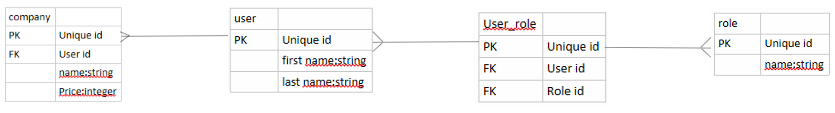
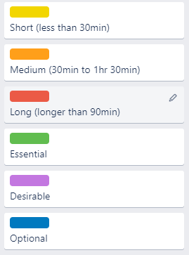

# DanielBaileyT2A2

## Problem solved by this app
This application allows entrepreneurs to put their business ideas up to be invested in, and it allows investors an easy way to invest in their business

## Why this problem needs to be solved
In Australia and around the world, there are many people with inventive ideas who would like to start their own companies to sell their ideas, but they lack the capital to do so.

## Deployed app link
https://whaletank-2021.herokuapp.com/

## GitHub repository link
https://github.com/Danielbailey309/DanielBaileyT2A2

## App Description
### Purpose
This application provides a central location for entrepreneurs to submit their business proposals, and for investors to invest in these businesses.
### Functionality / features
This app allows users to create accounts and login, add companies to their account, and in the future will allow investors to pay money through the application.
### Sitemap

### Target audience
The target audience for this app is anyone who has a business plan for their proposed business, as well as anyone with the funds to fund these businesses
### Tech stack
This application uses Ruby-on-Rails

## User stories
- As an investor I can browse the proposed companies
- As an investor I can view the profile of an entrepreneur
- As a user I can edit my profile once I have created it
- As an entrepreneur I can edit my company once I have created it
- As an entrepreneur I can upload a business plan about my proposed company
- As an entrepreneur I can enter basic details about the company I want to start
- As an investor I can view the business plan of a specific startup
- As an investor I can pay the requested startup cost of a company

## ERD

## Abstractions
- Users
- Roles
- Companies

## Third party services
This app is hosted on Heroku.

## Model Relationships
The application has four models: company, user, role, and user_role

company belongs to user.

user has a has_many relationship with company.

user has a has_many relationship with role, and vice versa.

This is achieved through the user_role model, to which each of these belongs and to each of these has a has_many relationship

## Database Relations
company is linked to user through the unique id of the user who is starting the company

user and role are linked to each other through their respective unique ids through the user_role table, which has it's own unique id for each relationship as it's primary key and uses these unique ids as it's foriegn key

## Allocation and Tracking of Tasks
Throughout this project, tasks were allocated and tracked according to the trello board, with different gradients from yellow to red representing the duration of how long the task will take to complete, and green, purple and blue representing essential, desirable and optional tasks respectively.
